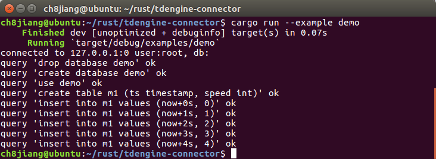
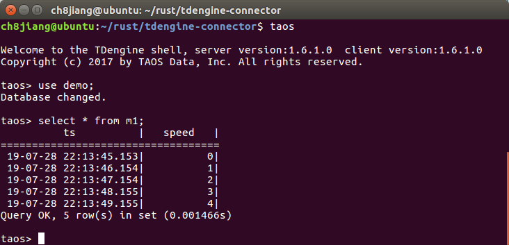

# TDengine driver connector of Rust

It's a rust implementation for [TDengine](https://github.com/taosdata/TDengine), an open-sourced big data platform designed and optimized for the Internet of Things (IoT), Connected Cars, Industrial IoT, and IT Infrastructure and Application Monitoring.

## Dependencies
- Tdengine: follow [here](https://www.taosdata.com/en/getting-started/) to install.
- Rust: follow [here](https://www.rust-lang.org/learn/get-started) to install.

## Run with Sample

Build and run:
```
git clone https://github.com/tidyjiang8/tdengine-connector.git && cd tdengine-connector
cargo run --example demo
```



And you can check the result with shell command `taos`:



